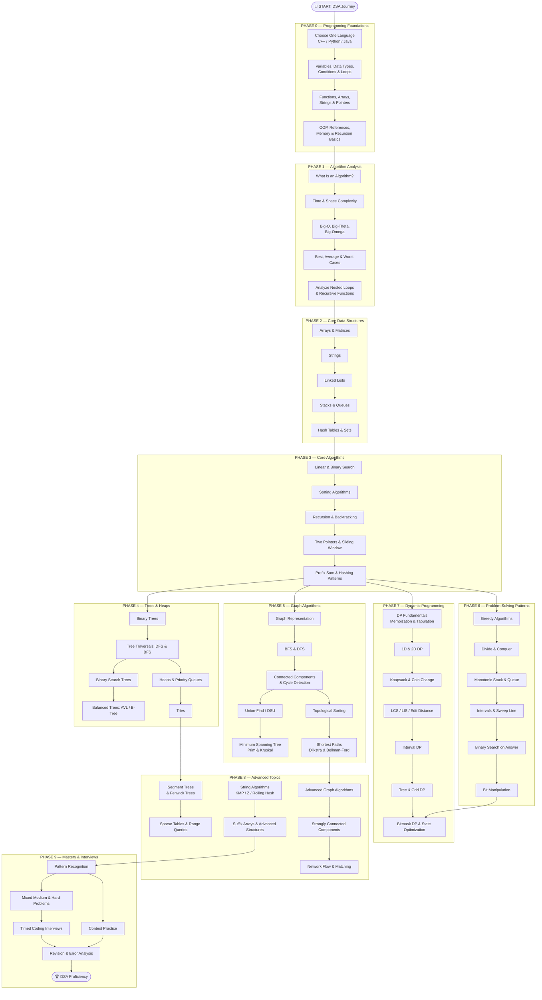

<!-- Bye Hand -->
<!--  -->
<!-- ═══════════════════════════════════════════════════════════════ -->

<!--                    GITHUB PROFILE README                       -->

<!-- ═══════════════════════════════════════════════════════════════ -->
<!-- <div align="center">
<br/>
<h3>𓆩◐𓆪</h3>
<sub>STOICDEVANSH</sub>
</div> -->

<div align="center">

#  Hi, I'm **Devansh**

### `Software Engineer` · `AI/ML Engineer` · `Problem Solver`

<!--  -->


<br/>

<a href="https://github.com/StoicDevansh">
  
</a>
<a href="https://github.com/StoicDevansh?tab=repositories">
  
</a>
<a href="https://github.com/StoicDevansh">
  
</a>

</div>

---

##  About Me

```text
🎓 Computer Science and Engineering Student
💻 Software Engineer
🤖 Exploring AI / ML and Agentic AI
🧠 Practicing Data Structures & Algorithms
⚙️ Interested in System Design, Backend & Developer Tools
🚀 Building projects to turn concepts into real-world systems
```

I enjoy understanding **how things work internally**, solving problems with **clean logic**, and continuously improving my **engineering fundamentals** and **Problem Solving Skills**.

### <picture> </picture>
### Currently Focused On

* 🧠 **Data Structures & Algorithms**
* 🐍 **C++**
* 💻 *Software Engineering fundamentals*
<!--* 🐳 **Docker & development tooling**
* 🗄️ **Databases and backend development**
* 🤖 **AI / ML / Agentic AI**
* 🏗️ **System Design**
* 🚀 **Building and deploying real-world projects**  -->


# 🛠️ Tech Stack

## 💻 Languages

<p align="left">


<!--  -->
<!--  -->
<!--  -->

</p>

---

## 🧠 Core Skills

<p align="left">


</p>

---

## 🗄️ Databases

<p align="left">


</p>

---

## ⚙️ Tools & Technologies

<p align="left">


</p>

---

### 🔍 Explored

<p align="left">


</p>


# 📚 What I'm Currently Learning

<table>
<tr>

<td width="50%">

### 🧠 Computer Science

* **Data Structures & Algorithms**
* **Advanced Problem Solving**

</td>

<td width="50%">

### 🚀 Engineering

* **Backend Development**
* **Docker**
* **TypeScript**
* **React**
* **REST APIs**
* **AI / ML**

</td>

</tr>
</table>

---

# 🧩 Problem Solving

> **Consistency over shortcuts.**

I am actively strengthening my **problem-solving ability** through:

```text
Arrays
   ↓
Hashing
   ↓
Two Pointers
   ↓
Sliding Window
   ↓
Stack & Queue
   ↓
Linked Lists
   ↓
Binary Search
   ↓
Trees & BST
   ↓
Graphs
   ↓
Heap / Priority Queue
   ↓
Greedy
   ↓
Dynamic Programming
```

## 🧠 DSA Roadmap — Beginner to Advanced

```mermaid
flowchart TD
    A(["🚀 DSA"]) --> B["Complexity Analysis"]
    B --> B1["Big-O · Recurrences · Amortized Analysis"]
    B1 --> C["Arrays & Hashing"]

    C --> D["Two Pointers"]
    C --> E["Stack"]
    C --> F["Prefix Sum"]
    C --> G["Sorting"]
    C --> H["Binary Search"]
    C --> I["Linked Lists"]
    C --> J["Sliding Window"]

    D --> D1["Opposite / Same Direction<br/>Fast & Slow Pointers"]
    J --> J1["Fixed / Variable Window<br/>Frequency Window"]
    F --> F1["Range Queries<br/>Difference Array"]
    E --> E1["Monotonic Stack / Queue<br/>Expression Evaluation"]
    G --> G1["Merge / Quick / Heap Sort<br/>Counting / Radix Sort"]
    H --> H1["Bounds · Rotated Arrays<br/>Binary Search on Answer"]
    I --> I1["Reversal · Cycle Detection<br/>Merge · Fast / Slow"]

    I --> K["Trees"]
    K --> K1["DFS: Pre / In / Postorder"]
    K --> K2["BFS: Level Order"]
    K --> K3["BST: Search / Insert / Delete"]
    K1 --> K4["LCA · Diameter · Path Sum<br/>Serialization · Tree DP"]
    K3 --> K5["Balanced Trees<br/>AVL · Red-Black · B-Tree / B+ Tree"]

    K --> L["Tries"]
    L --> L1["Prefix Search · Autocomplete<br/>Word Search · Bitwise Trie"]

    K --> M["Heap / Priority Queue"]
    M --> M1["Top-K · K-Way Merge<br/>Two Heaps · Median Stream"]

    C --> N["Intervals & Sweep Line"]
    N --> N1["Merge · Overlap · Scheduling<br/>Meeting Rooms · Event Ordering"]

    C --> O["Greedy"]
    O --> O1["Activity Selection · Jump Game<br/>Huffman · Scheduling"]

    C --> P["Recursion & Backtracking"]
    P --> P1["Subsets · Permutations<br/>Combinations · Combination Sum"]
    P1 --> P2["Pruning · Constraint Search<br/>N-Queens · Sudoku"]

    C --> Q["Divide & Conquer"]
    Q --> Q1["Merge Sort · Quickselect<br/>Inversion Count · Partitioning"]

    C --> R["Bit Manipulation"]
    R --> R1["XOR · Bitmasking · Subsets<br/>Bit Tricks · Bitmask DP"]

    C --> S["Math & Number Theory"]
    S --> S1["GCD / LCM · Primes · Sieve<br/>Modular Arithmetic · Fast Power"]
    S1 --> S2["Combinatorics · Probability<br/>Matrices · Geometry"]

    C --> T["Graphs"]
    T --> T1["Representations<br/>Adjacency List / Matrix / Edge List"]
    T1 --> T2["BFS / DFS · Grid Traversal<br/>Components · Cycle Detection"]
    T2 --> T3["Topological Sort<br/>Kahn · DFS · DAG"]
    T2 --> T4["Union-Find / DSU"]
    T4 --> T5["Minimum Spanning Tree<br/>Prim · Kruskal"]
    T1 --> T6["Shortest Paths"]
    T6 --> T7["BFS · Dijkstra · Bellman-Ford<br/>Floyd-Warshall · A*"]
    T2 --> T8["SCC · Bridges<br/>Articulation Points"]
    T8 --> T9["Advanced Graphs<br/>Eulerian Paths · Network Flow · Matching"]

    P --> U["Dynamic Programming"]
    U --> U1["State · Transition · Base Cases<br/>Memoization · Tabulation"]
    U1 --> U2["1D / 2D DP<br/>Climbing Stairs · House Robber"]
    U1 --> U3["Knapsack · Coin Change<br/>0/1 · Unbounded"]
    U1 --> U4["Subsequence DP<br/>LIS · LCS · Edit Distance"]
    U1 --> U5["Grid DP · Path Counting<br/>Unique Paths · Min Cost"]
    U1 --> U6["Interval DP<br/>Matrix Chain · Burst Balloons"]
    U1 --> U7["Tree DP · Rerooting<br/>Bitmask DP · Digit DP"]

    C --> V["Advanced Data Structures"]
    V --> V1["Fenwick Tree / BIT"]
    V --> V2["Segment Tree"]
    V2 --> V3["Lazy Propagation<br/>Range Updates / Queries"]
    V --> V4["Sparse Table · RMQ<br/>Persistent Structures"]

    C --> W["String Algorithms"]
    W --> W1["KMP · Z Algorithm<br/>Prefix Function · Rabin-Karp"]
    W1 --> W2["Rolling Hash · Aho-Corasick<br/>Suffix Array · LCP · Suffix Tree"]

    K4 --> X(["🏆 Pattern Recognition"])
    M1 --> X
    L1 --> X
    N1 --> X
    O1 --> X
    P2 --> X
    Q1 --> X
    R1 --> X
    S2 --> X
    T5 --> X
    T7 --> X
    T9 --> X
    U2 --> X
    U3 --> X
    U4 --> X
    U5 --> X
    U6 --> X
    U7 --> X
    V1 --> X
    V3 --> X
    V4 --> X
    W2 --> X

    X --> Y["Mixed Problems<br/>Easy → Medium → Hard"]
    Y --> Z["Timed Contests · Mock Interviews<br/>Revision · Error Analysis"]
    Z --> END(["✅ DSA MASTERY"])

    classDef root fill:#312e81,stroke:#a5b4fc,color:#fff,stroke-width:2px
    classDef core fill:#1e3a8a,stroke:#60a5fa,color:#fff
    classDef patterns fill:#164e63,stroke:#67e8f9,color:#fff
    classDef advanced fill:#4c1d95,stroke:#c4b5fd,color:#fff
    classDef finish fill:#14532d,stroke:#86efac,color:#fff,stroke-width:2px

    class A,END root
    class B,B1,C,D,E,F,G,H,I,J,K,L,M,N,O,P,Q,R,S,T,U core
    class D1,J1,F1,E1,H1,I1,N1,O1,P1,P2,Q1,R1 patterns
    class K4,K5,L1,M1,T3,T4,T5,T6,T7,T8,T9,U1,U2,U3,U4,U5,U6,U7,V,V1,V2,V3,V4,W,W1,W2 advanced
    class X,Y,Z finish
```




# 🧠 Data Structures & Algorithms — Complete Roadmap

<p align="center">
  <b>BEGINNER → INTERMEDIATE → ADVANCED → EXPERT</b>
  <br>
  A structured learning path for problem-solving, coding interviews, and competitive programming.
</p>

---

## 🧭 The Complete Learning Path



---

## 🟢 Level 1 — Beginner

**Goal:** Build strong programming logic and understand fundamental data structures.

* [ ] Choose C++, Python, or Java as your primary DSA language.
* [ ] Master variables, loops, functions, arrays, and strings.
* [ ] Learn pointers and references if using C++.
* [ ] Understand time and space complexity.
* [ ] Learn arrays, strings, linked lists, stacks, queues, and hashing.
* [ ] Implement linear search, binary search, and basic sorting.
* [ ] Understand recursion and basic backtracking.

**Milestone:** Solve easy problems independently and explain your solution's complexity.

## 🔵 Level 2 — Intermediate

**Goal:** Learn reusable problem-solving patterns and non-linear data structures.

* [ ] Two pointers and sliding window.
* [ ] Prefix sums and frequency maps.
* [ ] Fast and slow pointers.
* [ ] Monotonic stacks and queues.
* [ ] Binary trees and binary search trees.
* [ ] Tree traversals: preorder, inorder, postorder, and level order.
* [ ] Binary heaps and priority queues.
* [ ] Graph representation, BFS, DFS, and cycle detection.
* [ ] Greedy algorithms and divide and conquer.
* [ ] Recursion and backtracking patterns.

**Milestone:** Solve medium-level problems and recognize common patterns without relying on solutions.

## 🟣 Level 3 — Advanced

**Goal:** Handle complex constraints, optimization, and multi-step algorithms.

* [ ] Dynamic programming: 1D, 2D, knapsack, and subsequences.
* [ ] Longest common subsequence and edit distance.
* [ ] Binary search on an answer space.
* [ ] Topological sorting and strongly connected components.
* [ ] Union-Find with path compression and union by rank/size.
* [ ] Minimum spanning trees and shortest-path algorithms.
* [ ] Tries, segment trees, and Fenwick trees.
* [ ] String algorithms: KMP, Z algorithm, and rolling hash.
* [ ] Bit manipulation and bitmask dynamic programming.
* [ ] Advanced graph algorithms and range-query structures.

**Milestone:** Solve unfamiliar hard problems by deriving an approach, proving its correctness, and optimizing its complexity.

## 🔴 Level 4 — Competitive Programming & Interview Mastery

**Goal:** Build speed, precision, and independent problem-solving ability.

* [ ] Solve mixed problems without knowing the pattern beforehand.
* [ ] Practise timed contests and coding interviews.
* [ ] Review mistakes and maintain a problem-solving notebook.
* [ ] Re-solve previously difficult problems without looking at solutions.
* [ ] Practise explaining brute force before optimizing.
* [ ] Write correctness arguments and analyze time/space complexity.
* [ ] Study less-common algorithms based on the problems you encounter.
* [ ] Build consistency across easy, medium, and hard problems.

**Milestone:** Consistently solve unfamiliar problems under time constraints and explain your reasoning clearly.

## 📚 Practice Resources

* [LeetCode](https://leetcode.com/) — interview-style problems.
* [Codeforces](https://codeforces.com/) — competitive programming.
* [CSES Problem Set](https://cses.fi/problemset/) — structured algorithm practice.
* [USACO Guide](https://usaco.guide/) — structured explanations and exercises.
* [CP-Algorithms](https://cp-algorithms.com/) — advanced algorithms and reference material.
* [DSA Roadmap by roadmap.sh](https://roadmap.sh/datastructures-and-algorithms) — visual topic map.

---

<p align="center">
  <b>Consistency → Understanding → Independent Problem Solving</b>
  <br>
  Keep solving. Keep analyzing. Keep improving. 🚀
</p>


---

### 🎯 Platforms

<p align="left">

<a href="https://leetcode.com/">

</a>

<a href="https://neetcode.io/">

</a>

<!-- <a href="https://codeforces.com/">

</a>

<a href="https://www.hackerrank.com/">
 -->
</a>

</p>

---
<!-- 
# 🚀 Featured Projects

<table>
<tr>

<td width="50%">

### 🔥 SIH

**Short description of the project.**

```text
Frontend
Backend
Database
API
Deployment
```

🔗 [View Repository](https://github.com/StoicDevansh/PROJECT)

</td>

<td width="50%">

### 🤖 Nasa Space App Challenge

**Short description of the project.**

```text
Python
AI / ML
API
Database
Docker
```

🔗 [View Repository](https://github.com/StoicDevansh/PROJECT)

</td>

</tr>

<tr>

<td width="50%">

### ⚙️ GDG Hackfest 2.0

**Short description of the project.**

```text
C++
DSA
Algorithms
System Design
```

🔗 [View Repository](https://github.com/StoicDevansh/PROJECT)

</td>

<td width="50%">

### 🌐 WCTM Tech Fest

**Short description of the project.**

```text
React
TypeScript
Backend
REST API
Docker
```

🔗 [View Repository](https://github.com/StoicDevansh/PROJECT)

</td>

</tr>
</table>

--- -->

# 📊 GitHub Statistics

<div align="center">


</div>

---
### 💳 Github Profile Summary Card
 
 <div align=center>
  

  
 </div>
 
---

# 🔥 Contribution Streak

<p align="center">
  
</p>

<p align="center">
  
</p>


---

# 📈 Contribution Activity

<div align="center">


</div>

---

# 🐍 Contribution Snake

<div align="center">


</div>

---

# 🏆 GitHub Trophies

<div align="center">


</div>

---

# 💼 Developer Focus

<div align="center">

| Area                    | Focus                                            |
| :---------------------- | :----------------------------------------------- |
| 🧠 DSA                  | **Algorithms, Data Structures, Problem Solving** |
| 💻 Software Engineering | **Clean Code, OOP, Design Patterns**             |
| ⚙️ Backend              | **APIs, Databases, Authentication**              |
| 🗄️ Database            | **SQL, Schema Design, Optimization**             |
| 🐳 DevOps               | **Git, Docker, CI/CD**                           |
| 🤖 AI/ML                | **Machine Learning, LLMs, Agents**               |
| 🏗️ Architecture        | **System Design & Scalability**                  |

</div>

---

# 🌐 Connect With Me

<br>
<p align="center">

<a href="https://github.com/StoicDevansh">

</a>

<a href="https://www.linkedin.com/in/Stoic-Devansh/">

</a>

<a href="mailto:devansh.x.stoic@gmail.com">

</a>

</p>

## 📺 Latest YouTube Videos

<table>
  <tbody>
<!-- YOUTUBE:START --><tr><td><a href="https://www.youtube.com/channel/UCjrbl3UvIziZEQ8xRNvLq3A"></a></td>
<td><a href="https://www.youtube.com/watch?v=JdJ2VBbYYTQ">Future Youtube Channel</a><br/>Coming Soon</td></tr>

<!-- YOUTUBE:END -->
</tbody>
  </table>


<br>
<br>

<div align="center">


> 
> 🌿🎭 *“Peace is Permanent, Patience Is Not”*
> <div align="center">
> <br/>
> <h3>𓆩◐𓆪</h3>
> <sub>STOIC-DEVANSH</sub>
> </div>


<!-- <div align= "center">
   <b><i>*“Peace is Permanent, Patience Is Not”*</i></b> 
</div> -->


 <!--   -->

 <!--  -->

 <!--   -->

 <!--   -->


</div>
